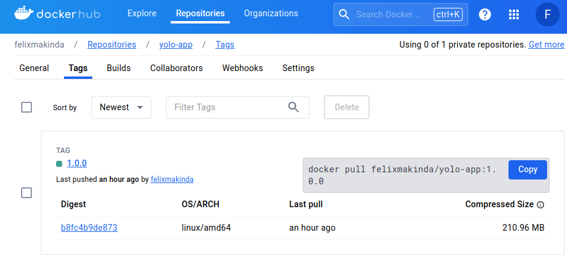
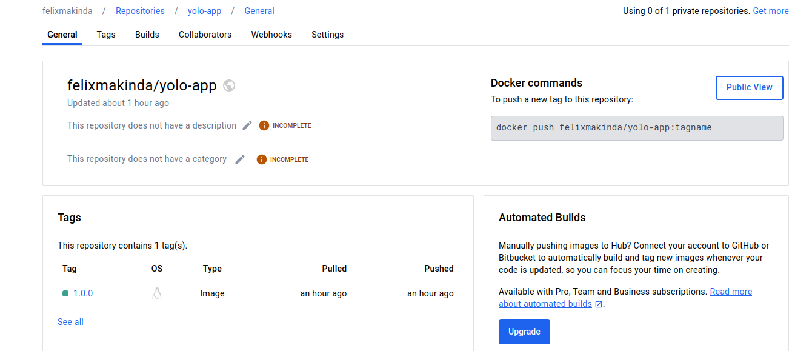

### Explanation for Implementation Decisions

1. **Choice of Base Image**:

   - For the client container, I chose the `node:18-alpine3.19` image as the base. This image is lightweight, optimized for Node.js applications, and uses Alpine Linux, resulting in smaller image sizes.
   - For the server container, I selected the `node:18-alpine3.19` image as well, considering its compatibility with the Node.js application. Alpine Linux reduces image size and enhances security by minimizing the attack surface.

2. **Dockerfile Directives**:

   - In the client Dockerfile, I used the `WORKDIR` directive to set the working directory, `COPY` to copy necessary files, `RUN` to install dependencies and build the React app, and `CMD` to start the NGINX server.
   - Similarly, in the server Dockerfile, I utilized `WORKDIR`, `COPY`, `RUN`, and `CMD` directives to configure the environment, install dependencies, and start the Node.js server.

3. **Docker-Compose Networking**:

   - In the Docker Compose file, I allocated port 80 for the client container to serve the React app. For inter-container communication, I created a bridge network named `yolo-network` to allow seamless communication between the client, server, and MongoDB containers.

4. **Docker-Compose Volume**:

   - I defined a volume named `mongodb_data` in the Docker Compose file to persist MongoDB data. This volume ensures that the data remains intact even if the MongoDB container is stopped or removed.

5. **Git Workflow**:

   - I followed a typical Git workflow, including committing changes, and pushing commits to a remote repository.

6. **Debugging Measures**:

   - To troubleshoot issues during application startup or runtime errors, I reviewed Docker logs (`docker logs <container_name>`), checked the exit codes of containers (`docker ps -a`), and examined the application's configuration files and dependencies.

7. **Docker Image Tag Naming**:
   - Following best practices, I named Docker images with descriptive tags indicating the version and purpose of the image. For example, `yolo-client:v1.0` helps in identifying the client image's content and version.

### Screenshot of Deployed Image on DockerHub

